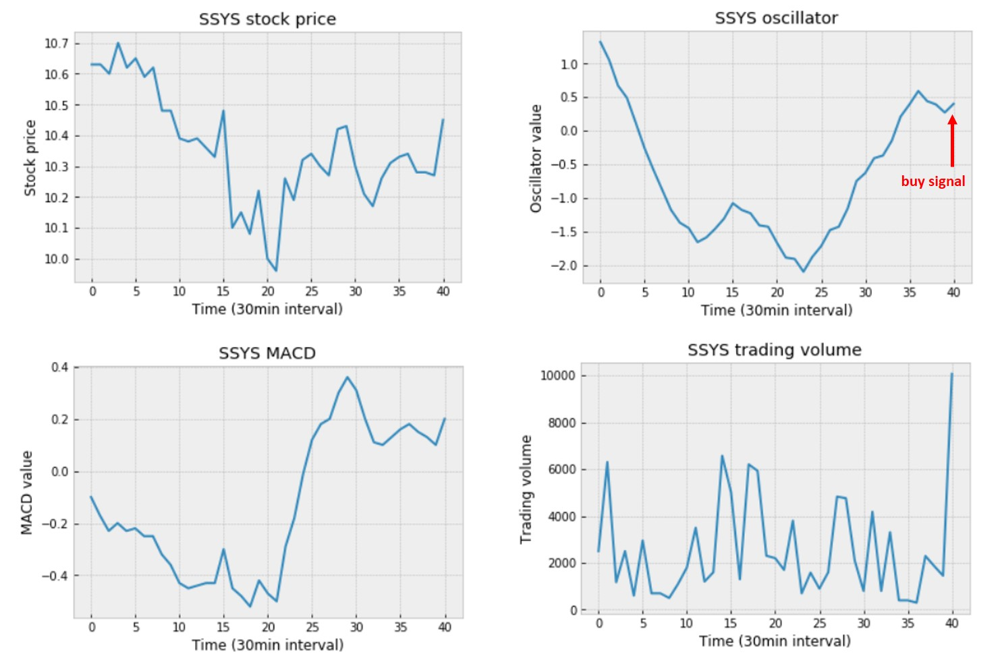

### **Seahorse: Machine Learning for Stock Trading**
## **Project Proposal**

*by: Simon Chiu, Gilbert Lei, Fan Wu, Linyang Yu*   

*May 3rd, 2019*  

## Executive Summary  

Seahorse Strategies developed a system, the Oscillator, which tracks stock prices and generates signals of buying or selling. The past results show that these signals still have room for improvements. In this project, we will apply statistical skills and machine learning techniques to build a model that can be used to evaluate the reliability of each buy/sell signal generated by this system. Our objective is to allow Seahorse Strategies to be able to rely much less on human judgments when making stock investment decisions and possibly improve return on their investments. We will deliver this model to Seahorse Strategies by Jun 26th, 2019.

## Introduction  

Seahorse Strategies has an algorithm (the Oscillator) that identifies overbought and oversold situations for a particular stock and gives buy/sell signals accordingly (usually once or twice per day). The baseline formula for a potential profit is to buy whenever the Oscillator’s curve hits a bottom turning upward and to sell whenever the curve is turning down. Currently, human judgement is required to decide on whether a buy or sell signal is indeed a good trade because it does not always win and make money on every time. Seahorse Strategies is interested in knowing whether the probabilities of winning could be quantified by looking at the time series data (every 30 mins) related to the Oscillator: stock price, time of day, MACD (Moving Average Convergence Divergence), etc. If we can quantify it, Seahorse Strategies can easily choose to go after only the signals with a high probability of winning. This project aims to develop a Python pipeline that takes the stock prices, MACD values, the Oscillator values and trading volumes 3-day prior to a trade signal as input and produces the winning probability of such a trade signal.

## Data Science Techniques  

The data sets we received are text files, each contains stock prices, MACD values, the Oscillator values and trading volumes of a particular stock. Each row in a file represents a buy or sell signal generated by the Oscillator with 41 time-series data points for closing stock prices, 41 for MACD values, 41 for the Oscillator values and 41 for trading volumes. All these data represent information in the 19.5 trading hours (equivalent to 3 trading days) prior to that signal. The last column of each row is the percentage return (%) of that signal.  

Below are plots of a row of data for stock SSYS.   

  

The financial market is stochastic and highly chaotic. Our main challenges is to identify useful features from our dataset. For example, researchers often find that stock price history has little to none impact on explaining the movements of the stock price in the future. However, even though our original dataset contains over 100,000 records with labels and features,  all of our features in our dataset besides trading volumes were calculated based on the stock price history. Also, all 164 features are coming from 4 sets of time series, therefore, we will be facing with problem of multicollinearity with these features. Overall, we have to be very mindful with our feature engineering process.

We will implement multiple (supervised) machine learning models to evaluate the reliabilities of the signals given by the Oscillator. The choice of models includes but not limited to Random Forest, Logistic Regression, Support Vector Machine and Naive Bayes. Later on, we may try some “black box” models such as Convolutional Neural Network and Recursive Neural Network. The final model will be selected based on its train/test accuracies, test precisions and prediction times.   

Our initial strategy includes three main phases; Modeling, Feature Engineering and Exception Handling. For the modeling section, we will use the logistic regression as our baseline model. In addition to this, we will modify its loss function to optimize for prediction precision instead of prediction accuracy. Our partner indicated several human judgements he uses to identify the reliable signals of the Oscillator. We will explore the effectiveness of those judgements and other possible features that are either directly or indirectly connected to the dataset. The applicable techniques include but not limited to Forward Selection, Recursive Feature Elimination, Principal Component Analysis and Singular Value Decomposition. Once we select our choice of model and features, we will test the model repeatedly and focus on identifying the outliers and other exceptional situations, then we will finalize the model based on these findings.

 

## Timeline and Evaluation  

| Milestone | Deliverable | Target Date |
| --- | --- | --- |
| Proposal Presentation | Proposal presentation deck | Apr 26th, 2019 |
| Complete Project Report | Project proposal | May 3rd, 2019 |
| Complete Model Selection: *after trying many different models, we will select one for further development* | - | May 17th, 2019 |
| Complete Model Development: *develop a model that has been optimized on hyperparameters and parameters and comes with necessary tests and documentation* | Data product | Jun 17th, 2019 |
| Final Presentation | Final presentation deck | Jun 18th, 2019 |
| Complete Final Report | Final report | Jun 26th, 2019 |
| Delivery Final Data Product | Final data product | Jun 26th, 2019 |

The model will be evaluated based on the accuracy in predicting the probability of winning for any buy/sell signal.
