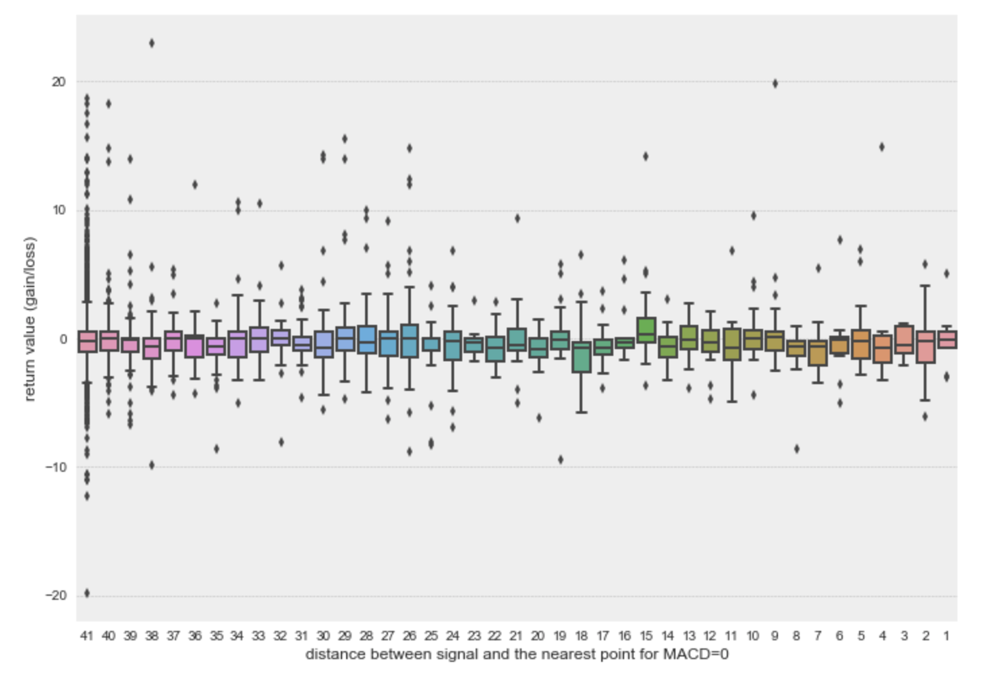

# Project Proposal  

### Executive Summary
Seahorse Strategies developed an oscillator system which tracks stock prices and, based on pre-defined conditions, generates buy or sell signals for targeted stocks. The past data show that these signals are not as good as expected. In this project, we will apply machine learning techniques to build a model that can be used to evaluate the reliability of each buy/sell signal generated by this oscillator system. With our model, Seahorse Strategies will be able to rely much less on human judgment when making stock investment decisions. We will deliver this model as a Python package to Seahorse Strategies.

In the first phase of this project, we will apply different machine learning techniques, to solve the problem and select a model with the best performance. To get there, we will try different machine learning models, such as Logistic Regression and Convolutional Neural Network, and different feature selection techniques. This phase will end in late May. In the second phase, we will fine tune the best performance model and turn it into a Python package and deliver this final data product to Seahorse Strategies by Jun 26th, 2019.

### Introduction

#### Research Question

The Oscillator is a tool for analyzing the stock price data via moving average and produces buy or sell signals to help investor(s) making the right decisions in the market. However, the tool still requires human judgment to identify the correct signals from the noise signals and it could be troublesome for the tool to work without its creator's supervision because of a few issues. For example, human judgment can have great variety among different people and it is hard to be quantified and interpreted. Meanwhile, for different stocks, the standard and outcomes of an investor's judgment could be shifted as well due to the variations in baseline (original stock price behavior).

Our main goal would be translating human judgment to the computer language, combining that information with other data resources, and providing a model to evaluate the reliabilities of the signals given by the Oscillator. The results of the model should be focusing on the precision of identifying a true “buy” or “sell” signal out from the false signals and the corresponding confidence level (probability) of such a signal being truly a good trade.

#### Objectives

1. Exploratory data analysis (EDA): during this process, we will focus on the original data resources provided by our partner.

	a) Explore the relationship among the time series of Oscillator, stock price, and MACD;

	b) Explore other possible features/indicators directly or indirectly connected to the "true" signal;

	c) Explore the effectiveness of the human judgment given by our partner based on his knowledge;

	d) Summarize all the possible indicators/predictors that we can use to train our model convincingly.

2. Exploring possible models to address our problem: our basic strategies should be based on machine learning

3. Exceptional and outlier handling based on the output of our model: during this process, the models from the last step will be tested repeatedly. We will be focusing on identifying the outliers and other exceptional situations and modifying our model based on the findings.

### Final Data Product

Our final data product would be a Python Package that takes in a 3-day times series of the values provided by the Oscillator for any given trade signal and computes the level of the reliability of such a signal.

### Data Science Techniques

#### Dataset

The data set we have are 3 time series of a collection of 30 stocks over a time period of 10 years (some stocks offer 20 years). Each stock comes with a set of the following data: (each time series has 3 days worth of data with each data point is 30 minutes apart)

| Features | Description |
|---|---|
| OSC | Time series of the Oscillator prior to sending a trade signal |
| STK | Time series of the Stock Price prior to sending a trade signal |
| MACD | Time series of the MacD indicator prior to sending a trade signal |

| Observational | Description |
|---|---|
| Rtn | Return of such trade if we follow the Oscillator|
| Lbl | Indicator of if this is a good trade (1 - Return > 0%, 0 - Return <= 0%), also the label of this machine learning problem|

#### EDA

Before we jumping into the modeling phase, our first objective is to explore the structure and the relationship among the different components of the original dataset.

*Figure 1a-1. Time Series of Oscillator, Stock Price and MACD under Buy-**EARN Condition***


*Figure 1a-2. Time Series of Oscillator, Stock Price and MACD under Buy-**LOSS Condition***


As our main goal is to understand and model the Oscillator outputs, we can start by analyzing the OSC values and discerning its patterns. The following image shows the autocorrelation (ACF) and partial autocorrelation (PACF) plots for buy-earn OSC values.

*Figure 1b. Time Series Analysis of a Buy-Earn Oscillator Data*


In the plot above, we can expect that the previous 5-10 data points have strong correlations with the current signal. The multicollinearity problem within the OSC values will be well considered in the modeling phase.

The next objective is to explore the effectiveness of the human judgment given by our partner based on his knowledge. For example, we will figure it out if the amplitude of the OSC values does indeed influence the results. We put together all the provided stocks' Buy-Earn ratios grouped by the OSC values, rounded to the 10s.

*Figure 1c. Boxplot of the distributions of the Buy-Earn ratio by amplitude of the OSC values*


The chart above shows that the distributions of Buy-Earn ratio are generally better on the negative side, which agrees with our partner's current understanding. We performed a similar analysis on Sell-Earn and found a result that agreeing with our partner's understanding as well.

#### Baseline Model

We applied a few of the machine learning models we learned from MDS to the dataset and obtained the following average accuracies and precisions from 20 runs.

*Table 1. Results from our Baseline Models*


#### Techniques and Appropriateness
##### Feature Engineering Techniques
Our partner also shared with us other possible indicators while using the Oscillator. Those indicators will be explored and applied as new features to train our models convincingly.

*Statement 1. Predictions are usually good when Oscillator looks like a smooth sine wave*

Our initial investigation toward the smooth sine wave was applying the Expontial Smoothing technique on the Oscillator outputs for both Buy-Earn and Buy-Loss cases and trying to study their patterns. However, it was hard to distinguish whether of them should be consider as a "smooth sine wave".

*Figure 1d-1. Exponential Smoothing on a Buy-Earn Oscillator Data*


*Figure 1d-2. Exponential Smoothing on a Buy-Loss Oscillator Data*


~~For further explorations, we will apply the Fast Fourier Transform (FFT) on OSC values to convert the time series to a representation in the frequency domain, and study the behaviors of the decomposed frequencies by using the idea of the Power Spectral Density (PSD) in Spectral Analysis. Once we are able to indicate the relationship between PSD and the "true" signal, we will add PSD as a new feature into our machine learning model.~~

Based on the meeting with Collin today, the FFT might not be useful in this case. We will still explore the features that we can generated from this method. But we will be put more effort on the smoothness and curvature of the OSC curve.


*Statement 2. Extreme OSC values usually have not much predictabilities*

Our partner mentioned that as the breaking news happen, the stock market can be extremely volatile which influences the OSC values becomes dramatically high or low. We studied the returns' behaviors of a specific stock and the result confirmed with our partner's claim.

*Figure 1d-3. Average Returns on a Stock's Oscillator Data


We will add an indicator that is able to identify the extreme OSC values as a new feature into our machine learning models.

*Statement 3. Crossovers of MACD generally identify good trading signals*

We also explore the relationship between the MACD curve and good trading signals. Since each buy signal is related with a three day period MACD time series, we can calculate how many zero values (cross points) are presents in the MACD curve. We also quantified the distance between the signal and the closest point for MACD=0. 

*Figure 1d-4. Summarize the MACD distribution


Based on the summarized histogram above, we can observe that most buy signal are generated with zero MACD=0 record in the past three days. And by studying the relationship between the MACD and the returns (gain or loss values), we can barely discover any direct correlation.

*Figure 1d-5. Average Returns vs. # of MACD=0 in the past three days


*Figure 1d-6. Average Returns vs. distance to the nearest point with MACD=0



Additionally, we will apply the feature selection techniques such as Forward Selection, Recursive Feature Elimination(RFE), Principal Component Cnalysis(PCA) and Singular value decomposition(SVD) to reduce the overfitting problems, improve the accuracy and precision results and reduce training time.

##### Machine Learning Models
Random Forest, Logistic Regression, Support Vector Machine and Naive Bayes

##### Cross-Validation & Hyperparameter Tuning

##### Netural Network: Convolutional Neural Network and Recursive Neural Network;

We also performed the basic NN tuning with the current data by construct the sequencial layers. So far, the output accuracy of the model has great variation. 

*The code below works based on Google colab
```{Python}

model = Sequential()
model.add(Dense(400, input_shape=(X_train.shape[1],), activation='relu'))
model.add(Dense(256, activation='relu'))
model.add(Dense(256, activation='relu'))

model.add(Dense(1, activation='softmax'))
batch_size = 10
epochs = 5
model.compile(loss='binary_crossentropy', optimizer='adam', metrics=['accuracy'])

history = model.fit(X_train, y_train,
                    batch_size=batch_size, epochs=epochs,
                    verbose=1, validation_data=(X_test, y_test))
```

#### Difficulties

- Correlation between our source data;
- The trade-off between sensitivity and consistency;
- Using loss function focusing on precision. 

### Timeline and Evaluation
Based on our discussion within the team and with project mentor, we defined project milestones in below.  

| Milestone | Deliverable | Target Date |
| --- | --- | --- |
| Finish proposal presentation | Proposal presentation deck | Apr 26th, 2019 |
| Finish project proposal | Project proposal | May 3rd, 2019 |
| Finalize model selection | NA | May 17th, 2019 |
| Finalize proof-of-concept model | NA | May 24th, 2019 |
| Finish final presentation | Final presentation deck | Jun 18th, 2019 |
| Finish final report | Final report | Jun 26th, 2019 |
| Finish final data product | Final data product | Jun 26th, 2019 |
