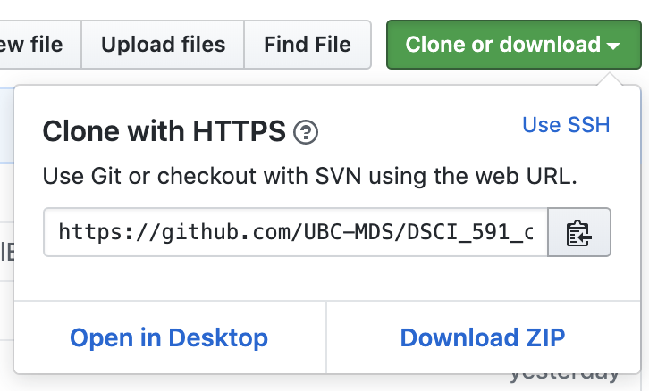

# Seahorse Strategies

## Table of Contents

- [Contributors](#contributors)
- [Overview](#overview)
- [Main Scripts](#main-scripts)
- [Repository Structure](#repository-structure)
- [Software Installation](#software-installation)
- [Usage](#usage)
- [Functions](#functions)
- [Package Dependencies](#package-dependencies)

----

## Contributors:

|Name|Simon Chiu|Gilbert Lei|Fan Wu |Linyang Yu |
|--|--|--|--|--|
|User Id|[cheukman1207](https://github.com/cheukman1207)|[gilbertlei](https://github.com/gilbertlei)|[fwu03](https://github.com/fwu03)|[lyyu0413](https://github.com/lyyu0413)|

## Overview

Seahorse Strategies Inc. developed a system, the Oscillator, that tracks stock price movements and generates buy and sell signals when certain conditions are met. Statistical analysis shows that these signals are not always reliable and there is room for improvements. This repo's program is designed for evaluating each buy/sell signal generated by this system and identify good ones on which the company may choose to trade. The model developed in this program is a supervised learning model based on the LightGBM framework. It can efficiently evaluate a huge number of signals and score each signals. A signal with a score of 90 or 100 has an expected return 2.5 - 5 times higher than that of a randomly selected signal.   

## Main Scripts

**Train.py**    

This function performs model training that applies the LightGBM Regressor to the data in the `Train_data` folder. It then saves the model for prediction later.

**Predict.py**    

This function performs prediction on the returns of the signals in the `Prediction` folder and provides a score for each signal to indicate if it is likely to be a gain or a loss. It takes the choice of a saved model generated by the `Train` function as an argument.

## Repository Structure:

#### DSCI_591_capstone-Seahorse
  * [Functions](Functions) & [Unit Testing](Functions/Unit_testing): folder contains all the required functions and their unit testing
    * 01_data_import.py
    * 02_data_organize.py
    * 03_smooth_generator.py
    * 04_derivative.py
    * 05_volatility.py
    * 06_ratio.py
  * [Models](Models): folder to store trained models
  * [Prediction](Prediction): folder to store prediction results
  * [Test_data](Test_data): folder that contains all the data to be evaluated
  * [Train_data](Train_data): folder that contains all the data for model training
  * [Training_report](Training_report): folder to store reports of cross validation results
  * [Others](Others): folder to store all the other works for this project
    * [Documentations](Others/doc)
    * [Images](Others/img)
    * [Scripts](Others/src)
  * [CODE_OF_CONDUCT.md](CODE_OF_CONDUCT.md)
  * [Predict.py](Predict.py)
  * [Train.py](Train.py)
  * [README.md](README.md)
  
The following screenshot shows the workflow of the system:


## Software Installation

Software required to run the system:
- Git
- Python 3

__Git__

The command line version of Git will be used here.

[Windows]

1. Click [here](https://git-scm.com/download/win) to download the windows version git. After the download is completed, run the installer and select the following options:
   + On the `Select Components` page, check “On the Desktop” under “Additional icons”
   + On the `Choosing the default editor used by Git` page, select “Use the Nano editor by default” from the drop-down menu
   + For all other pages, use the default options
2. After installation, a Git Bash icon will be on the Desktop

[macOS]

1. Open Terminal and type the following command:

```
xcode-select --install
```

2. Check the Git version by:

```
git --version
```

__Python 3__

The system uses the Python 3, not Python 2. [Anaconda](https://www.anaconda.com/distribution/#macos) is an easy-to-install distribution of Python and includes many popular libraries.

1. Please download the Python 3 for Windows or macOS
2. After the installation is completed, follow the instruction to run the installer
3. To check the Python version, you can type the following command in the terminal:

```
python --version
```
4. If you were successful, you will see something like this:

```
Python 3.7.1
```


*For more details, please see MDS's document on [install guide](https://ubc-mds.github.io/resources_pages/installation_instructions/)*

## Usage

__Step 1. Clone Repository from Github__

Click the green `Clone or Download` button, and copy the URL to the clipboard.



Open the Unix Shell instance (e.g. Terminal or Git for Windows), and navigate to your target directory by typing:

```
cd (path to the directory)
```

Type `git clone` and paste the URL:

```
git clone https://github.com/UBC-MDS/DSCI_591_capstone-Seahorse.git
```

Press `enter` to clone the repository to your local machine.

*For more details, please see GitHub's document on [cloning](https://help.github.com/en/articles/cloning-a-repository)*


__Step 2. Load Train and Test Data__ 

Load train data into `Train_data` folder, and test data into `Test_data` folder. Please ensure the following:
- Train data must include 124 columns; 41 for oscillator values, 41 for stock prices, 41 for macd values, and 1 for investment return
- Test data must include 123 columns; 41 for oscillator values, 41 for stock prices and 41 for macd values
- File names must contain `Buy` or `Sell` to indicate whether it is a set of buy or sell signals
- Files must be in .txt format

__Step 3. Run Train.py Script__ 

Open Unix Shell instance and navigate to the cloned repository by:

```
cd (the path to the repo)
```

and then enter:

```
python Train.py
```

The process may take a few minutes to run. After it completes, four files will be generated with the current date and time:

1. A training report in the `Training_report` folder (Train_Report_yyyy_mm_dd_hhmm.pdf)
2. A trained model in the `Model` folder (Model_yyyy_mm_dd_hhmm.sav)
3. A rubric for prediction purpose in the `Training_report/rubric` folder (Train_Rubric_yyyy_mm_dd_hhmm.csv) 
4. A screenshot for the training report in the `Training_report/img` folder (Cross_Validation_Result_Boxplot_yyyy_mm_dd_hhmm.png) 

__Step 4. Training Report Review__ 

The training report is in the `Training_report` folder. It contains two cross validation tables (mean and standard deviation) and a boxplot. 

The two tables contains parameters (mean and standard deviation) to describe the signals with scores in a certain group, averaging over all the cross validation run.

|Column Name|Meaning|
|--|--|
|score_rd| Signals grouped by the score assigned by the model|
|StkUpRate| Ratio of signals with positive returns in the group (0:0% - 1:100%)|
|Stk Mvt% | Average return of the signals in the group|
|BuySig% | Ratio of signals that is a buy signal|
|% of All Trades| Ratio of total signal in the group (0:none - 1:all signals in this group)|

Boxplot: The boxplot shows the average returns of each score group, each point represent the average return from one cross-validation run. A wider box means the signals in that group is relatively risker, and vice versa.

Once you find a statisfied report, the corresponding model can be used for prediction.

__Step 5. Prediction__ 

Open the Unix Shell instance, navigate to the cloned repository, and enter:

```
python Prediction.py
```

You will see the following screen:


Enter the date and time of the selected model (e.g. 2019_06_22_1123)

The prediction result will be generated under the `Prediction` folder (Prediction_yyyy_mm_dd_hhmm.csv) with a timestamp follows by the selected model. The last column of the file, `Score_rd`, is the predicted resulted for the test data.

__Step 6. Clean Files (Optional)__ 

Open the Unix Shell instance, navigate to the cloned repository, and enter:

```
python Clean.py
```

This operation will clean all files that are generated by both `Train.py` and `Prediction.py`.

## Functions  
We developed six functions that are called by the train.py and prediction.py programs.  

__1. Data Import:__ Load (train/test) data into the system  
__2. Data Organize:__ Break the data into multiple groups such as oscillator(osc), stock price(stk), macd  
__3. Smooth Generator:__ Calculate the smoothness of a curve  
__4. Derivative:__ Calculate the derivative of a curve (either absolute or relative change)  
__5. Volatility:__ Calculate the volatility of a curve  
__6. Ratio:__ Calculate the ratios between the values of two curves  

## Package Dependencies

|Software|Version|
|--|--|
|Git|2.17.2|
|Python|3.7.1|


|Package|Version|Package|Version|
|--|--|--|--|
|numpy|1.16.2|matplotlib|3.0.3|
|pandas|0.24.2|seaborn|0.9.0|
|scipy|1.2.1|reportlab|3.5.23|
|lightgbm|2.2.3|pickle|1.0.2|
|sklearn|0.20.3|datetime|4.3|


